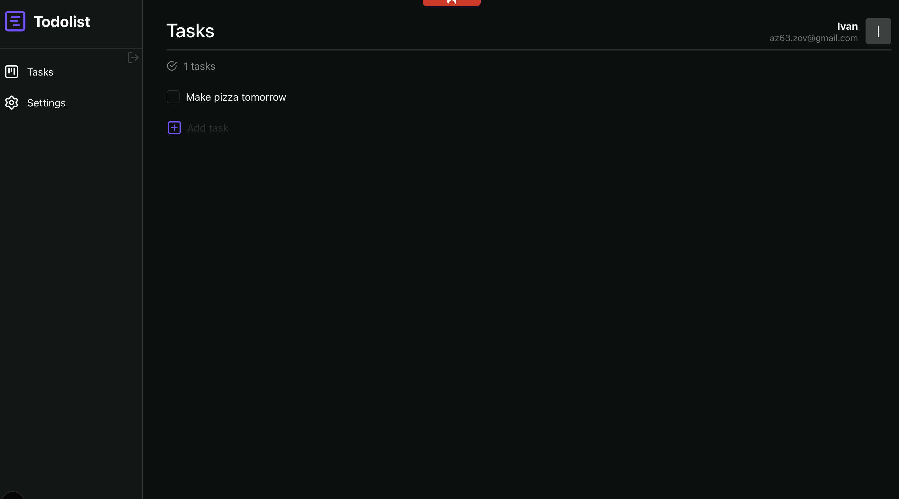

# Todolist App

A modern, full-stack task management application built with Next.js 16 and React 19. This application provides a clean and intuitive interface for managing your daily tasks with features like task creation, editing, completion tracking, and user authentication.



## Features

- ✅ **Task Management**: Create, edit, delete, and mark tasks as complete
- 🔐 **Authentication**: Secure login and registration system with JWT tokens
- 👤 **User Profile**: Customize your profile settings and work intervals
- 📊 **Task Counter**: Real-time count of your tasks
- 🎨 **Modern UI**: Clean, responsive design with smooth animations
- 🔄 **Real-time Updates**: Instant UI updates with optimistic mutations
- 🚀 **Fast Performance**: Built with Next.js 16 and Turbopack

## Tech Stack

### Frontend

- **Next.js 16.0.4** - React framework with App Router
- **React 19.2.0** - UI library
- **TypeScript** - Type safety
- **Tailwind CSS v4** - Utility-first CSS framework
- **Motion (Framer Motion 12)** - Animations
- **React Hook Form 7.66.1** - Form management
- **TanStack Query 5.90.11** - Server state management

### Backend Integration

- **Axios 1.13.2** - HTTP client with interceptors
- **JWT Authentication** - Cookie-based auth with access/refresh tokens
- **RESTful API** - Communication with backend server

### Development Tools

- **ESLint** - Code linting
- **PostCSS** - CSS processing
- **Lucide React** - Icon library
- **js-cookie** - Cookie management

## Getting Started

### Prerequisites

- Node.js 18+
- Yarn or npm
- Backend API server running on `http://localhost:5200`

### Installation

1. Clone the repository

```bash
git clone <repository-url>
cd todolist
```

2. Install dependencies

```bash
yarn install
# or
npm install
```

3. Set up environment variables
   Create a `.env.local` file in the root directory:

```env
NEXT_PUBLIC_API_URL=http://localhost:5200/api
```

4. Run the development server

```bash
yarn dev
# or
npm run dev
```

5. Open [http://localhost:3000](http://localhost:3000) in your browser

## Project Structure

```
src/
├── app/                  # Next.js App Router pages
│   ├── auth/            # Authentication page
│   ├── i/               # Protected dashboard routes
│   │   ├── tasks/       # Task management
│   │   └── settings/    # User settings
│   └── layout.tsx       # Root layout
├── components/          # React components
│   ├── ui/              # Reusable UI components
│   └── dashboard/       # Dashboard-specific components
├── hooks/               # Custom React hooks
├── services/            # API services
├── types/               # TypeScript type definitions
└── config/              # App configuration
```

## Key Features Explained

### Authentication

- Cookie-based authentication with access and refresh tokens
- Protected routes using Next.js middleware
- Automatic token refresh on expiration

### Task Management

- Create tasks with a simple form
- Edit tasks inline by clicking on them
- Delete tasks with trash icon (appears on hover)
- Toggle task completion with checkbox
- Real-time task counter

### User Settings

- Update profile information
- Configure work/break intervals
- Change password

## API Integration

The app communicates with a backend API at `localhost:5200/api` with the following endpoints:

- `POST /auth/register` - User registration
- `POST /auth/login` - User login
- `POST /auth/logout` - User logout
- `GET /user/profile` - Get user profile
- `PUT /user/profile/update` - Update profile
- `GET /user/task/get-tasks` - Get all tasks
- `POST /user/task/create` - Create new task
- `PUT /user/task/update/:id` - Update task
- `DELETE /user/task/delete/:id` - Delete task

## Scripts

```bash
yarn dev          # Start development server
yarn build        # Build for production
yarn start        # Start production server
yarn lint         # Run ESLint
```

## License

This project is open source and available under the MIT License.

## Author

Built with ❤️ using Next.js and React
